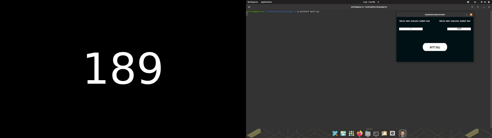

# BASAR APP I PYTHON
Dette er en enkel basarapp i Python. 
<h3>Installasjon og krav:</h3>
<p>

- Python
- PIL
- Tkinter
</p>

<h4>PYTHON: </h4>
<p>Les dokumentasjon: https://www.python.org/
<h4>PIL/Tkinter: </h4>
Hvis Python er installert rett, er det bare å kjøre denne kommandoen i terminalen

```bash
pip install pillow tk
```
<h3>Kjør programmet:</h3>
<p>Gå til <b>src</b> og kjør <b>main.py</b></p>


<h3>Eksempel:</h3>

